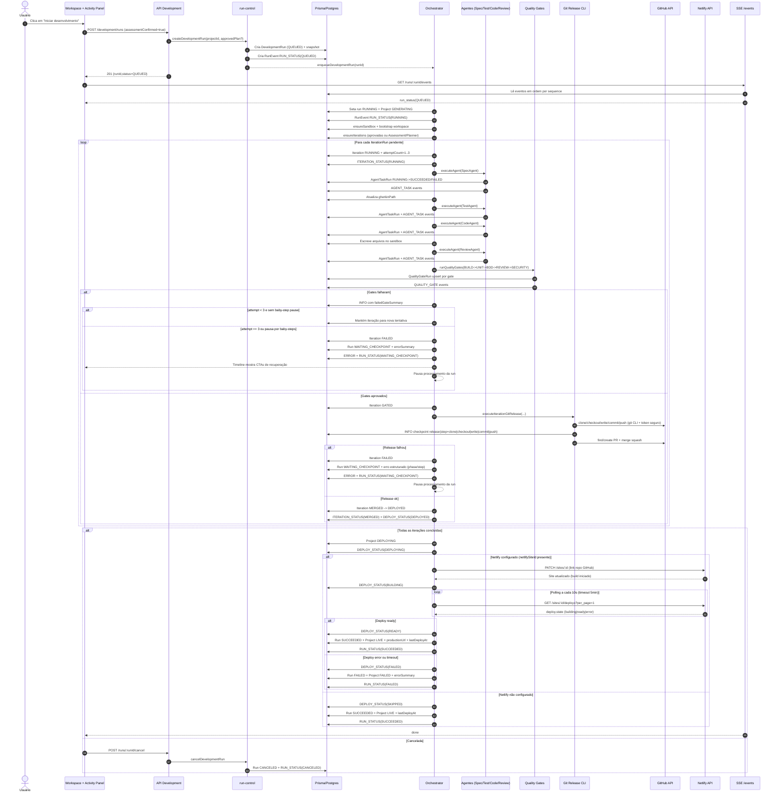

# Diagrama de Sequência da Fase de Desenvolvimento

## Objetivo
Este documento mostra, em ordem temporal, como a fase de desenvolvimento funciona: UI, APIs, orquestrador, agentes, gates, release, banco e GitHub.

## Diagrama de Sequência (Execução Real)

## Leitura Guiada do Fluxo
### 1) Disparo na UI e validações de entrada
O fluxo começa quando o usuário clica em iniciar desenvolvimento. O frontend chama `POST /api/projects/:id/development/runs` com `assessmentConfirmed=true`.

A API valida:
- autenticação e ownership do projeto;
- pré-requisitos de planos (`business`, `technical`, `ux`);
- schema do desenvolvimento autônomo no banco;
- flag de execução de gates habilitada.

Se já existe run ativa (`QUEUED|RUNNING|WAITING_CHECKPOINT`), a API não abre outra run: retorna a run atual com `alreadyActive=true`.

### 2) Criação da run e enfileiramento
Quando a criação é permitida:
- `DevelopmentRun` é criada com `status=QUEUED`;
- snapshot dos planos é congelado em `plansSnapshot`;
- evento `RUN_STATUS(QUEUED)` é persistido em `RunEvent`;
- o orquestrador é enfileirado via `enqueueDevelopmentRun(runId)`.

Nesse ponto a UI já pode assinar SSE e exibir estado inicial.

### 3) Inicialização assíncrona no worker
No início real de processamento (`processDevelopmentRun/processRunInternal`):
- run muda para `RUNNING`;
- `Project.status` muda para `GENERATING`;
- sandbox efêmero é criado para a run;
- bootstrap do workspace é aplicado (templates base/fallback).

Também aqui é resolvido o plano de iterações:
- se veio plano aprovado no snapshot, ele é usado;
- se não veio, `AssessmentAgent` e `IterationPlannerAgent` são executados para gerar o plano.

### 4) Entrada em uma iteração e controle de tentativas
Para cada `IterationRun` pendente:
- iteração vai para `RUNNING`;
- `currentIteration` da run é atualizado;
- evento `ITERATION_STATUS(RUNNING)` é emitido;
- começa o loop de tentativas (`attempt=1..3`).

### 5) Drill-down do ciclo BDD/TDD dentro da tentativa
Ordem fixa na tentativa:
1. `SpecAgent`
2. `TestAgent`
3. `CodeAgent`
4. gravação física de artefatos no sandbox
5. `ReviewAgent`
6. quality gates

#### 5.1) `SpecAgent` em detalhe (o “gap” entre passos 17 e 20)
Quando o orquestrador chama `executeAgent(SpecAgent)`:
1. é criado `AgentTaskRun` com `status=RUNNING`;
2. evento `AGENT_TASK started` é persistido;
3. o agente retorna JSON com `gherkinPath`, `gherkin`, `featureTags`, `files[]`;
4. `AgentTaskRun` é atualizado para `SUCCEEDED` (ou `FAILED`) com `output`;
5. evento `AGENT_TASK succeeded/failed` é emitido.

Só depois disso o orquestrador executa `IterationRun.update({ gherkinPath: ... })`.

Conclusão importante:
- sim, o gherkin já foi gerado no output do `SpecAgent`;
- nesse momento ele está persistido no `AgentTaskRun.output` e em memória (`specResult`);
- o arquivo físico ainda não foi escrito no sandbox nesse exato ponto.

#### 5.2) O que acontece antes do `TestAgent`
Entre o fim do `SpecAgent` e o início do `TestAgent`, o único passo obrigatório é o update do `gherkinPath` em `IterationRun`.

Se esse update falhar, o fluxo não avança para `TestAgent`.

#### 5.3) `TestAgent` e `CodeAgent`
`TestAgent` e `CodeAgent` seguem o mesmo padrão de execução via `executeAgent`:
- criam/atualizam `AgentTaskRun`;
- emitem `AGENT_TASK`;
- devolvem `files[]` e metadados no `output`.

#### 5.4) Quando os arquivos realmente viram arquivo no disco
Após `Spec + Test + Code`, o orquestrador:
- extrai `files[]` dos três outputs;
- faz merge/deduplicação por path;
- grava no sandbox com `writeWorkspaceFiles(...)`;
- emite evento `INFO` com quantidade de arquivos escritos.

Aqui os artefatos passam a existir fisicamente no workspace da run.

### 6) Review e gates
Depois da escrita no sandbox:
- `ReviewAgent` roda;
- gates executam em ordem: `BUILD -> UNIT -> BDD -> REVIEW -> SECURITY`;
- cada gate persiste em `QualityGateRun` e emite `QUALITY_GATE`.

### 7) Decisão após gates
Se algum gate falhar:
- o orquestrador registra resumo de falha;
- tenta nova execução da mesma iteração até o limite;
- ao estourar limite (ou pausa baby-steps), move para `WAITING_CHECKPOINT`.

Se todos os gates passarem:
- iteração vira `GATED`;
- fluxo segue para release real.

### 8) Release real (sem simulação)
No release:
- arquivos do sandbox são coletados;
- `git CLI` executa `clone`, `checkout`, `write`, `commit`, `push`;
- checkpoints dessas etapas viram eventos `INFO` com `phase=release` e `step`;
- PR é criado ou reutilizado;
- merge squash é executado.

Se release falhar:
- iteração vai para `FAILED`;
- run vai para `WAITING_CHECKPOINT`;
- erro estruturado (`phase/step/summary`) é persistido.

Se release passar:
- iteração evolui `MERGED -> DEPLOYED`.

### 9) Ações de recuperação e continuidade
Em `WAITING_CHECKPOINT`, a UI deve oferecer:
- `Retomar checkpoint`;
- `Tentar novamente iteração`;
- `Cancelar execução`.

Cada ação gera novos eventos e pode reabrir o processamento sem perder histórico.

### 10) Deploy na Netlify
Quando todas as iterações chegam ao fim com sucesso, o orquestrador inicia o deploy:
- projeto muda para `DEPLOYING`;
- evento `DEPLOY_STATUS(DEPLOYING)` é emitido.

Se o projeto tem `netlifySiteId` configurado:
- `linkSiteToRepository` faz PATCH no site Netlify com a config do repo GitHub;
- Netlify automaticamente inicia o primeiro build;
- polling a cada 10s via `getLatestDeploy` até estado terminal (`ready` ou `error`) ou timeout de 5 minutos;
- se `ready`: projeto vira `LIVE`, `productionUrl` é atualizada;
- se `error` ou timeout: projeto vira `FAILED` com `errorSummary`.

Se o projeto **não** tem Netlify configurado:
- deploy é ignorado com evento `DEPLOY_STATUS(SKIPPED)`;
- projeto vai direto para `LIVE` (comportamento anterior).

### 11) Finalização da run
Após o deploy (ou skip):
- run vira `SUCCEEDED`;
- evento final `RUN_STATUS(SUCCEEDED)` é emitido;
- SSE envia `done`.

### 12) Consistência operacional (evitar estado confuso)
Toda transição crítica precisa ter 3 evidências coerentes:
- persistência no banco (`DevelopmentRun`, `IterationRun`, `AgentTaskRun`, `QualityGateRun`, `RunEvent`);
- evento correspondente na timeline;
- estado derivado corretamente na UI.

Se uma dessas evidências faltar, a etapa não deve ser considerada concluída.

## Referências no Código
- `src/lib/development/orchestrator.ts`
- `src/lib/development/run-control.ts`
- `src/lib/development/agent-executor.ts`
- `src/lib/development/quality-gates.ts`
- `src/lib/development/git-release-cli.ts`
- `src/lib/development/gitops.ts`
- `src/lib/development/deploy.ts`
- `src/lib/netlify/client.ts`
- `src/lib/development/events.ts`
- `src/components/project/DevelopmentActivityPanel.tsx`
